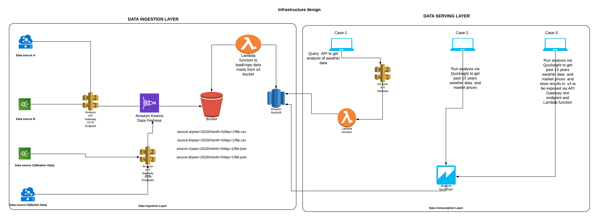

# Air Quality Standard (AQS)

## Project structure

- `aqs` contain all lambda functions source code for etl and analysis jobs
- `layers` contain dependencies which are shared between lambda functions in `aqs`
- `serverless` contains infrastructure resources for project

## Requirements

- [aws-cli](https://github.com/aws/aws-cli) (installation method is OS specific) use for deployment of iam roles

- [nodejs](https://nodejs.org/) (installation method is OS specific)

- [Serverless](https://serverless.com/) `version >=1.45.1 <2.0.0`

 Run the following command in the root repository root directory

  ```bash
  npm install
  ```

## Deployment

### environment variables configuration

Configuration is passed to deployed resources via setting environment variables

The content of `.env` file is required for configuring deployments to target accounts with environment variables settings.

For unix-like operating systems create file with name `.env` with content specific to target account:

```bash
export AWS_PROFILE='default'
export AWS_ACCOUNT='30*****410'
```

And execute

```bash
source .env
```

The above command overwrites default configuration presented inside `serverless-*.yml` files
`serverless.env.yml` contains a bucket for storing etl output and can be editted, in case it already exist

### Infrastructure (Lambdas, S3 Bucket):**

Stage `dev` (use predefined values):

- Deployment

  ```bash
  npm run deploy-layers
  npm run deploy-etl
  npm run remove-analysis
  ```

- Cleaning

  ```bash
  npm run remove-layers
  npm run remove-etl
  npm run remove-analysis
  ```

## Testing

To run the tests you will need Docker and Java 8 installed.
Install the dependencies with:

```bash
make install
```

And run tests with:

```bash
make test
```

## Infrastructure Design

 
